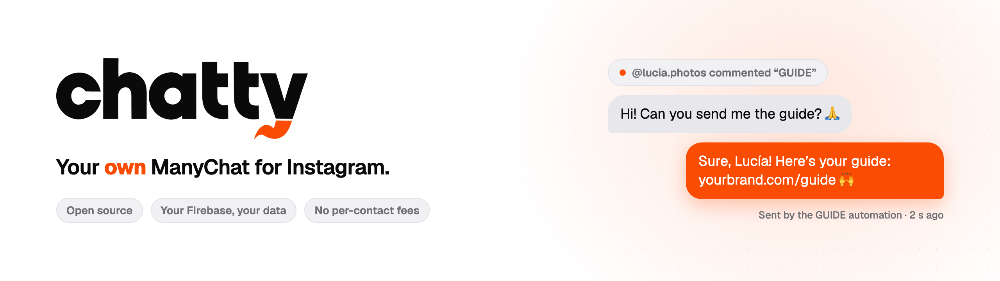

## Hi, I'm Bruno 👋

I founded **[Vareliuu](https://vareliuu.com)**, a software studio in Monterrey, Mexico 🇲🇽. I build
websites, apps and custom software for businesses, from idea to production in a few weeks. On
Instagram I share **AI, untangled** (in Spanish): how I build with Claude and other tools, no hype.

- 🔭 **Now:** [Chatty](https://github.com/brunovareliuu/chatty), your own ManyChat for Instagram, open source.
- 🛠️ **Stack:** React, Next.js and TypeScript on Firebase; mobile apps with Expo.
- 🤖 **How:** with AI every day, from design to deploy.
- 💬 **Where:** [vareliuu.com](https://vareliuu.com) · [Instagram](https://www.instagram.com/brunovareliuu)

## Open source

<a href="https://github.com/brunovareliuu/chatty">
  <picture>
    <source media="(prefers-color-scheme: dark)" srcset="chatty-oscuro.png">
    
  </picture>
</a>

**[Chatty](https://github.com/brunovareliuu/chatty)**: an inbox for your DMs, keyword automations,
a visual flow builder and your Instagram analytics, on **your** Firebase. It opens in guided mode
with nothing configured and walks you step by step until it's live.

## Tech I use

---

  <b>Got a project in mind?</b> <a href="https://vareliuu.com/cotizar">Get a quote at vareliuu.com</a> ↗

